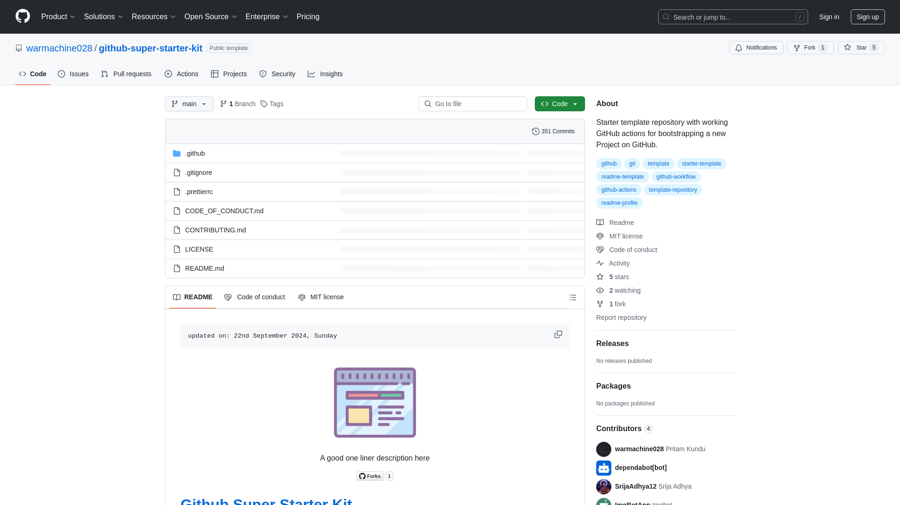

    updated on: 24th December 2024, Tuesday

<div align=center>
    <a href="https://github.com/SrijaAdhya12/appsium">
        
    </a>
    <p style="font-family: roboto, calibri; font-size:12pt; font-style:italic"> A mini social media application build on Appwrite </p>
    <a src="https://github.com/SrijaAdhya12/appsium/forks">
        
    </a>
</div>

# [Appsium](https://github.com/SrijaAdhya12/appsium)

![line]

## Table of Contents

- [Introduction](#introduction)
- [Installation](#installation-guide)
- [Tech Stack Used](#tech-stack-used)
- [Preview](#preview)
- [Best Contributors](#best-contributors)
- [License](#license)

![line]

## Introduction

- A mini social media application build on Appwrite
- Appwrite’s built-in authentication simplifies user registration and login
- Instantly share posts and store media using Appwrite’s database and storage

![line]
  1. Download NodeJS >18.0.1
  2. Run the following commands for runinng for appwrite folder
  3. set up `.env` with the help of `.env.example` file in appwrite folder
```sh
$> cd appwrite
$> npm i       # install all packages
$> npm run dev # run the project
```

![line]

## Tech Stack Used

- JavaScript
- React
- Appwrite
- Vercel


      
![line]

## Preview

<picture align="center">
    <source media="(prefers-color-scheme: light)" srcset=".github/preview-light.png">
    <source media="(prefers-color-scheme: dark)" srcset=".github/preview-dark.png">
    
</picture>

![line]

## Best Contributors

<div align="center">
    <a href="https://github.com/SrijaAdhya12/appsium/graphs/contributors">
        
    </a>
</div>

![line]

## License

- See [LICENSE]

**SrijaAdhya12, 2024**

![line]

## Thank you, everyone 💚

[icons]: https://icons8.com
[markdown-badges]: https://github.com/Ileriayo/markdown-badges
[custom-icons]: https://simpleicons.org
[line]: https://user-images.githubusercontent.com/75939390/137615281-3a875960-92cc-407f-97fe-fd2319bdb252.png
[License]: https://github.com/SrijaAdhya12/appsium/blob/main/LICENSE

<!-- 24/12/24 -->
